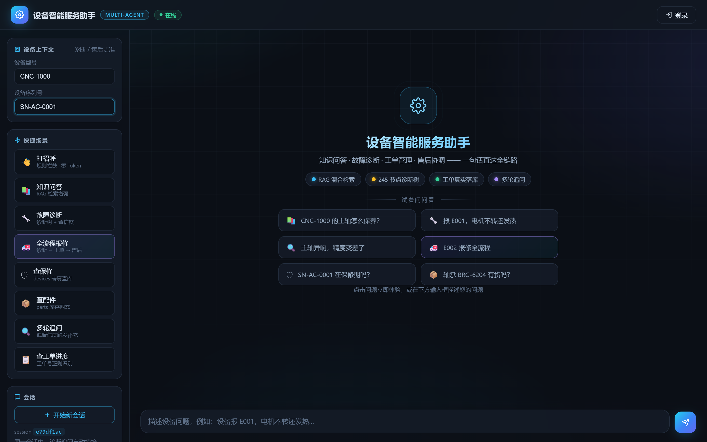
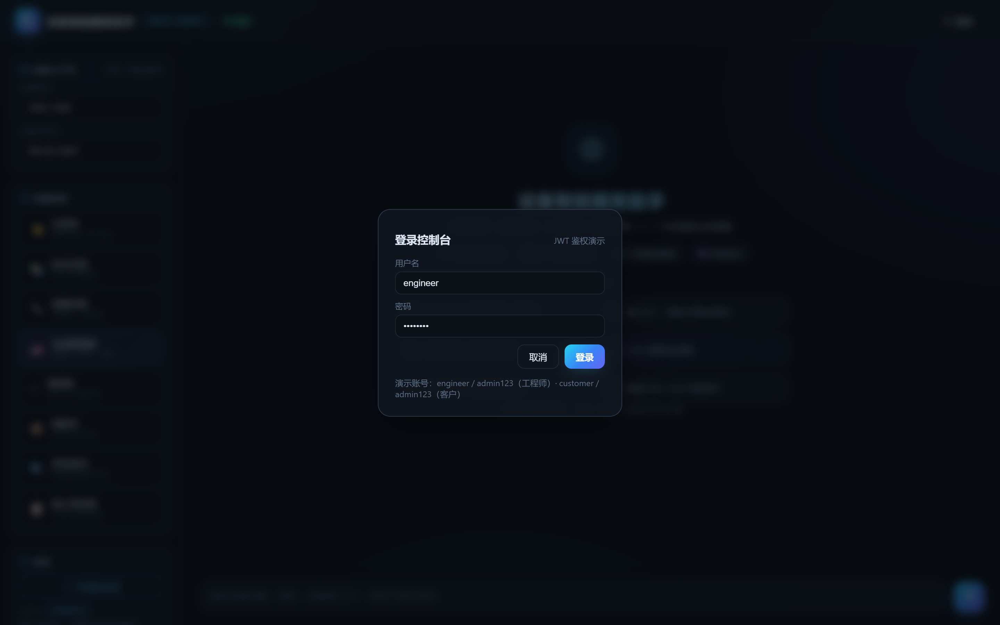
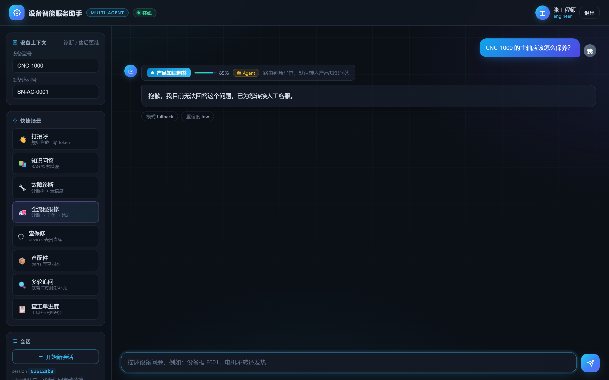
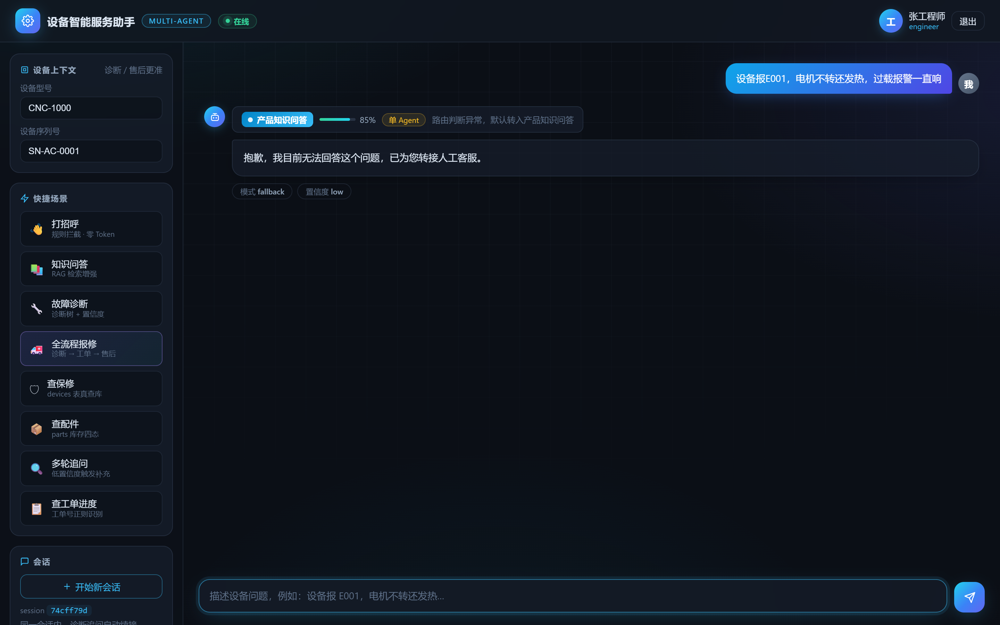
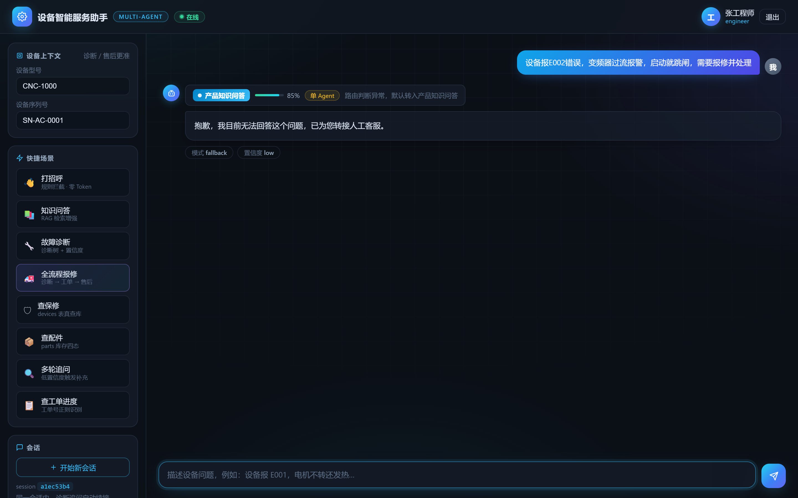
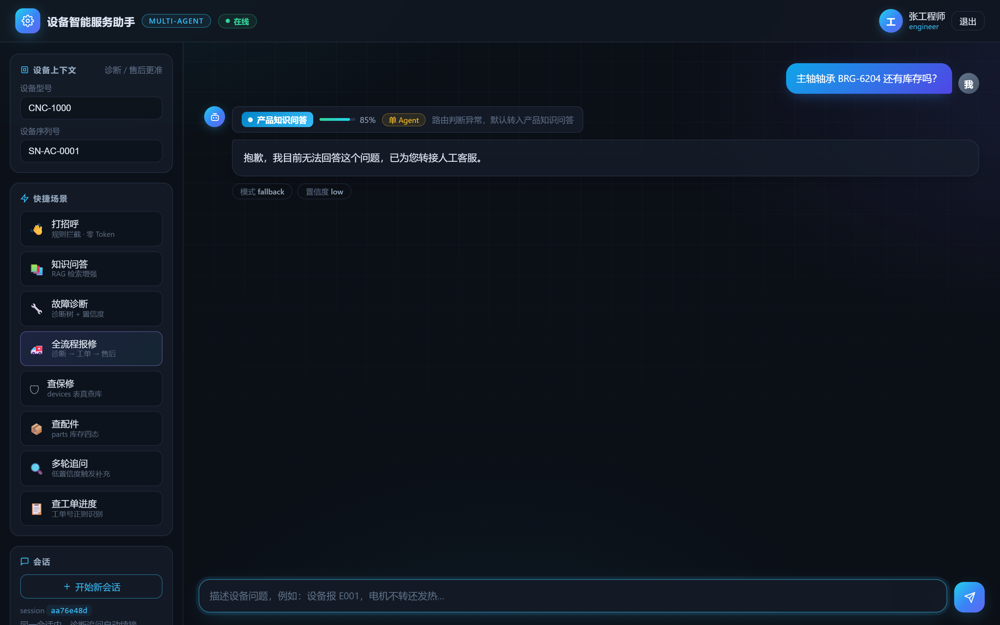

# industrial-ops-agent — 工业设备智能运维多 Agent 平台

面向 **工业设备制造商与使用方** 的多 Agent 智能运维平台，面向钢铁/流程行业「设备全生命周期管理」的业务场景，用大模型智能体重塑设备运维的 **点检 → 诊断 → 报修 → 备件 → 售后** 全链路。

## 界面预览

零构建演示前端（`backend/static/`），服务启动后访问 http://localhost:8000/ 即可体验。
以下截图由 `python scripts/take_screenshots.py` 对真实运行系统自动拍摄（Playwright + 系统 Edge 无头模式，真实 LLM 对话）：

| 欢迎屏 · 预设问题 | JWT 登录 |
|:---:|:---:|
|  |  |

| 知识问答（RAG + 来源引用） | 故障诊断（置信度 + 处理方案） |
|:---:|:---:|
|  |  |

| 全流程报修（诊断 → 工单 → 售后） | 售后配件查询（parts 真查库） |
|:---:|:---:|
|  |  |

> 全流程报修一图包含：意图路由卡片 → Pipeline 三步时间线 → E002 诊断结论 → 工单号 TK-…落库 → 保修状态查询 → `diagnosis → ticket → after_sale` Agent 链。

## 为什么做这个

传统设备运维存在三个痛点：

1. **知识沉淀难**——老师傅的经验、维修手册、设备档案散落在文档和脑海里，无法规模化复用；
2. **故障响应慢**——从客户报障、人工判断、创建工单到派单上门，链路长、反复确认信息；
3. **管理靠人盯**——点检计划、设备状态、保修期、备件库存全凭人工记忆和纸质台账，异常发现滞后。

本平台把工艺与维修经验固化为 **知识库 + 诊断树**，用 **AI 智能体** 把「人找事」变成「事找人」，让设备运维从**被动响应**走向**主动服务**。

## 核心能力

| 能力 | 说明 | 状态 |
|---|---|---|
| 设备台账与生命周期 | 设备档案、安装位置、保修期、运行状态一站式管理 | ✅ 已实现 |
| 运维知识库问答 | RAG 检索设备手册、维修案例，7×24 智能问答 | ✅ 已实现 |
| 故障诊断推理 | 诊断树 + 大模型推理双引擎，多轮追问，输出带置信度的根因与方案 | ✅ 已实现 |
| 智能点检巡检 | 点检任务自动生成、路线规划、异常重点提醒 | ⬜ 规划中 |
| 维修工单闭环 | 诊断结论自动生成工单，流转、催单、审计日志全记录 | ✅ 已实现 |
| 备件与售后协调 | 保修查询、备件库存核对、上门预约 | ✅ 已实现 |

## 系统架构

### 主编排图

```
                        ┌──────────────────────────────┐
  客户 / 运维人员 ─────▶ │   ① 意图识别与路由 Agent       │
   (微信/Web/API)        │   规则拦截 + LLM 路由 + 分类器  │
                        └──────────────┬───────────────┘
                                       │
              ┌────────────┬───────────┼───────────┬──────────────┐
              ▼            ▼           ▼           ▼              ▼
        ② 设备台账    ③ 运维知识库  ④ 故障诊断   ⑤ 点检巡检   ⑦ 备件与售后
         Agent          Agent        Agent        Agent         Agent
         (EAM)          (RAG)      (诊断树+LLM)  (AI点巡检)    (工具调用)
              │            │           │            │              │
              │            │           ▼            │              │
              │            │      ⑥ 工单管理 Agent ◀┘              │
              │            │          (闭环+审计)                  │
              └────────────┴───────────┴─────────────────────────────┘
                                            │
                                            ▼
                                     [End / 转人工]
```

### 每个 Agent 内部模式

每个 Agent 内部遵循 **Serial Pipeline + Retry/Fallback** 模式：

```
extract_input → retrieve/reason → generate → check_quality ─┬─ pass → generate → END
                                                            └─ fail → fallback → END
```

- LLM 调用统一走 `retry → fallback → raise` 链路；
- 结构化输出用 Pydantic + function calling；
- 所有外部系统调用（ERP/CRM/WMS）设置超时并带降级路径；
- 诊断结论标注置信度，低置信度自动追问或转人工。

## 技术选型

| 领域 | 选型 |
|---|---|
| 语言 / 编排 | Python 3.11+ · LangGraph 1.0+ · LangChain 1.2+ |
| 大模型 | DeepSeek V4（Flash 主力 / Pro 推理），兼容 OpenAI 接口 |
| 结构化输出 | Pydantic + `with_structured_output`（function calling） |
| 向量检索 | Milvus 2.4+（Dense + Sparse 混合检索）· BGE-M3 · BGE-Reranker |
| 后端 | FastAPI + SSE 流式响应 |
| 数据库 | PostgreSQL + asyncpg + SQLAlchemy 2.0 |
| 认证 | JWT（python-jose + bcrypt） |
| 部署 | Docker Compose（私有化部署）· Nginx（反代 + SSE） |
| 监控（规划） | Langfuse（LLM 链路追踪与评估） |

## 路线图

### Phase 1 — 诊断闭环（MVP）
- [x] 故障诊断 Agent（诊断树 + LLM 推理，带置信度与追问）
- [x] 工单管理 Agent（诊断结论自动生成工单，状态机 + 审计日志）
- [x] 统一对话入口（规则拦截 + LLM 路由 + 流式响应）
- [ ] 设备台账 Agent（设备档案/保修期/状态查询）

### Phase 2 — 知识底座
- [x] 运维知识库（RAG：手册/维修案例入库，混合检索 + 精排）
- [x] 售后协调 Agent（保修/备件/预约）
- [x] Supervisor 主编排（多 Agent pipeline 全流程）

### Phase 3 — 主动运维
- [ ] 点检巡检 Agent（任务自动生成、路线规划、异常提醒）
- [ ] 管理后台（知识库管理 / Agent 配置 / 对话评估）

### Phase 4 — 预测性维护（远期）
- [ ] 设备状态监测数据接入，预警模型 + 诊断模型

## 项目结构

```
backend/
├── agents/                 # 各 Agent 实现（每 Agent 独立 State/Node/Graph/Prompt）
│   ├── knowledge/          #   运维知识库 Agent（RAG）
│   ├── diagnosis/          #   故障诊断 Agent（诊断树 + 追问循环）
│   ├── ticket/             #   工单管理 Agent（真实落库 + 审计）
│   └── after_sale/         #   备件与售后协调 Agent（保修/配件/预约，parts 表真查库）
├── core/                   # 核心基础设施
│   ├── llm_factory.py      #   LLM 工厂（按 Agent 路由 / 结构化输出 / 缓存）
│   ├── retry.py            #   重试与降级（retry → fallback → raise）
│   ├── exceptions.py       #   统一异常体系
│   ├── logger.py           #   结构化日志
│   └── query_classifier.py #   MiniLM 意图分类器
├── api/                    # 对外 API（chat / knowledge / ticket / diagnosis / after_sale）
├── db/                     # 数据库（models / migrations，9 张表含 parts 备件表）
├── knowledge_base/         # RAG 管线（loader/splitter/embedder/writer/retriever/reranker）
├── static/                 # 演示前端（零构建：index.html + SSE 聊天 + JWT 登录）
├── session_state.py        # 会话状态注册表（pipeline 中断续跑）
├── supervisor.py           # Supervisor 主编排服务类
└── main.py                 # FastAPI 入口（挂载 API + 静态演示页）

data/                       # 知识库数据（诊断树 / 维修实例 / 知识库样本，脱敏）
deploy/                     # docker-compose / Dockerfile / nginx / .env.example
docs/                       # 架构 / API / 部署文档
scripts/                    # 建库 / 数据库初始化 / 种子数据 / 评估 / 预检 / 演示
tests/                      # 测试（114 用例，离线可跑）
```

## 快速开始

```bash
# 1. 安装依赖（推荐 conda 环境：conda create -n industrial_agent python=3.11 -y）
pip install -r requirements.txt

# 2. 配置环境变量（填写 DEEPSEEK_API_KEY 等）
cp deploy/.env.example .env.local

# 3. 启动 PostgreSQL / Milvus 等依赖（Docker）
docker compose -f deploy/docker-compose.yml up -d

# 4. 初始化数据库（建表 + 索引）
python scripts/migrate.py

# 5. 写入开发种子数据（用户 / 客户 / 设备 / 备件，幂等）
python scripts/seed_dev_data.py

# 6. 构建知识库（可选，将设备手册写入 Milvus 向量库）
python scripts/build_knowledge_base.py data/knowledge_sample.md --course-id CNC-1000 --no-context
#    或一键种子：python scripts/seed_knowledge.py

# 7. 演示环境预检（一条命令检查 Docker/PG/Milvus/种子数据/LLM 配置）
python scripts/preflight_check.py

# 8. 启动服务
python -X utf8 -m uvicorn backend.main:app --reload --port 8000
```

- **演示页面**：http://localhost:8000/ （零构建静态前端：登录 + SSE 对话，路由卡片/进度/追问/Pipeline 全事件渲染）
- API 文档：http://localhost:8000/docs
- 健康检查：http://localhost:8000/health
- 种子账号：`engineer / admin123`、`customer / admin123`

```bash
# 测试
pytest tests/ -v

# 诊断树匹配层离线评估（改词表/阈值/停用词后必跑，零 LLM 依赖）
python scripts/evaluate.py

# 故障诊断离线演示（无需 API Key）
python scripts/demo_diagnosis.py
```

## 相关文档

- [系统架构设计](docs/architecture.md)
- [API 文档](docs/api.md)
- [部署指南](docs/deployment.md)

## License

私有化部署产品，商业授权请联系项目方。
